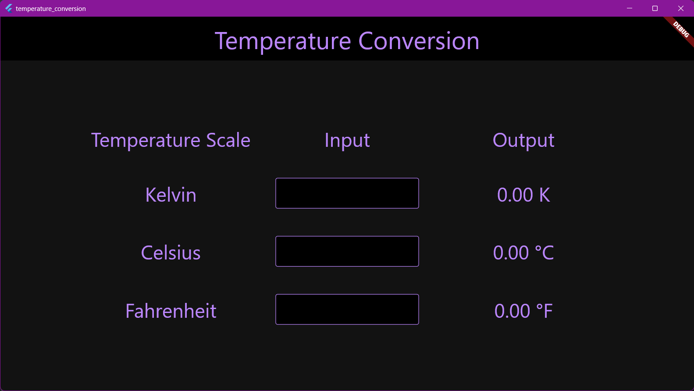

# Temperature Conversion

A flutter application that allows converting from any temperature scale (Kelvin, Celsius, Fahrenheit) into others.

# Running The Application

You need to have the Flutter SDK installed to run the application.  
Visit the [official flutter website](https://docs.flutter.dev/get-started/install]) to install the Flutter SDK.  
To clone the repository use the `git clone` command.  
After cloning the repository `cd` into the project folder.  
Run the command `flutter pub get` to install all the dependencies of the project.  
Run the command `flutter run` to run the application.

# Screenshot

